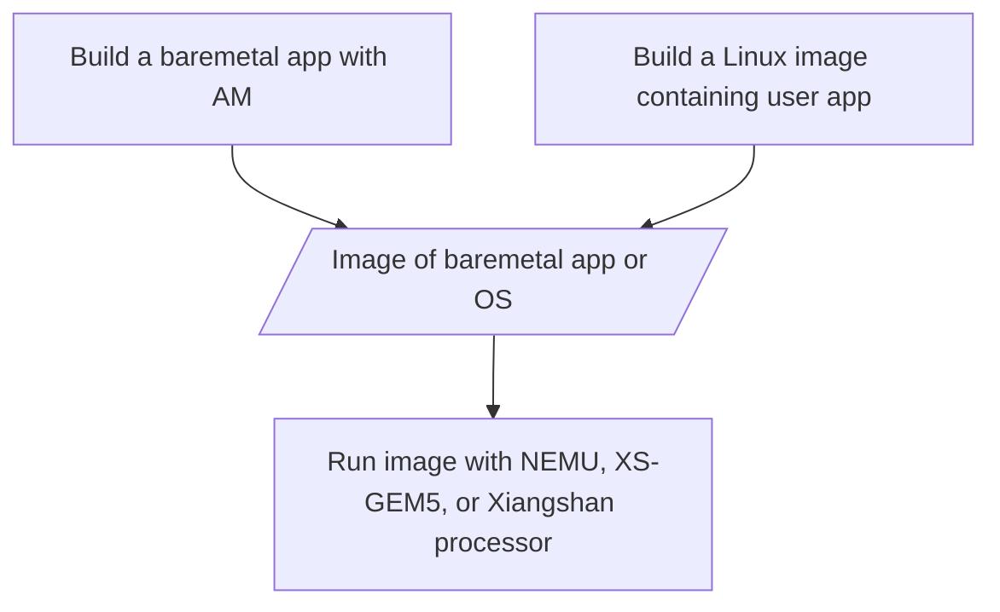
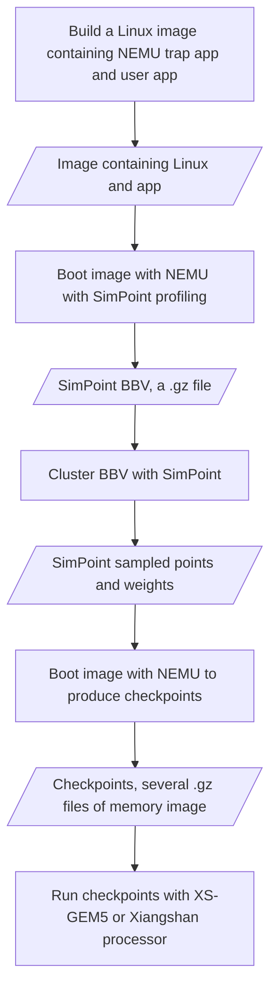

# NEMU

NEMU(NJU Emulator) is a simple but complete full-system emulator designed for teaching purpose.
Currently it supports x86, mips32, and riscv32.
To build programs run above NEMU, refer to the [AM project](https://github.com/NJU-ProjectN/abstract-machine).

The main features of NEMU include
* a small monitor with a simple debugger
  * single step
  * register/memory examination
  * expression evaluation without the support of symbols
  * watch point
  * differential testing with reference design (e.g. QEMU)
  * snapshot
* CPU core with support of most common used instructions
  * x86
    * real mode is not supported
    * x87 floating point instructions are not supported
  * mips32
    * CP1 floating point instructions are not supported
  * riscv32
    * only RV32IM
* memory
* paging
  * TLB is optional (but necessary for mips32)
  * protection is not supported
* interrupt and exception
  * protection is not supported
* 5 devices
  * serial, timer, keyboard, VGA, audio
  * most of them are simplified and unprogrammable
* 2 types of I/O
  * port-mapped I/O and memory-mapped I/O

## Typical flow for running workloads

### Run without checkpoint

The typical flow for running workloads is similar for [NEMU](https://github.com/OpenXiangShan/NEMU/),
[XS-GEM5](https://github.com/OpenXiangShan/GEM5),
and [Xiangshan processor](https://github.com/OpenXiangShan/XiangShan).
All of them only support full-system simulation.
To prepare workloads for full-system simulation, you need to either build a [baremetal app](#run-baremetal-app) or
[running user programs in an operating system](#run-opensbi-and-linux).




### Produce and run checkpoints

Because most of the enterprise users and researchers are more interested in running larger workloads,
like SPECCPU, on XS-GEM5 or Xiangshan processor.
To reduce the simulation time of detailed simulation, NEMU also serves as a checkpoint producer.
The flow for producing and running checkpoints is as follows.
The detailed instructions for each step is described in Section [Howto](#howto).



### Run as reference design

To validate the correctness of Xiangshan processor or XS-GEM5,
NEMU can also used as a reference design of Xiangshan processor.

### What is NOT supported

- Cannot directly run an ELF.
- System call emulation is not supported.([What is system call emulation](https://stackoverflow.com/questions/48986597/when-to-use-full-system-fs-vs-syscall-emulation-se-with-userland-programs-in-gem))
- User space emulation is not supported.([What is user space emulation](https://www.qemu.org/docs/master/user/main.html))
- Cannot produce GEM5's SE checkpoints or m5 checkpoints
- Cannot run GEM5's SE checkpoints or m5 checkpoints
- Recommend NOT to produce a checkpoint in M-mode.

### Please DO NOT

- Please don't running SimPoint bbv.gz with NEMU, XS-GEM5, or Xiangshan processor, because it is not bootable.
- Please don't make a new issue without reading the doc
- Please don't make a new issue without searching in issue list

## Howto

### Run baremetal app

[ready-to-run](https://github.com/OpenXiangShan/ready-to-run/) provides prebuilt baremetal apps.
To use them, run
```
git submodule update --init ready-to-run
./build/riscv64-nemu-interpreter -b ./ready-to-run/coremark-2-iteration.bin
```

### Build baremetal app with Abstract Machine

[Abstract Machine](https://github.com/OpenXiangShan/nexus-am) is a light-weight baremetal library.
Common simple apps like coremark and dhrystone can be built with Abstract Machine.
The README of Abstract Machine contains instructions for building apps.

### Build a Linux image

Please read [the doc to build Linux](https://xiangshan-doc.readthedocs.io/zh-cn/latest/tools/linux-kernel-for-xs/).

### Boot image with NEMU with SimPoint profiling

### Build SimPoint and cluster BBV with SimPoint

### Boot image with NEMU to produce checkpoints

### Run a checkpoint with XS-GEM5 or Xiangshan processor

Run a checkpoint with Xiangshan processor

```bash
./build/emu -i /path/to/a/checkpoint.gz
```

Run checkpoints with XS-GEM5: [the doc to run XS-GEM5](https://github.com/OpenXiangShan/GEM5?tab=readme-ov-file#run-gem5)


## FAQ

### Why cannot produce a checkpoint in M-mode?

Read the source code of [GCPT restorer](https://github.com/OpenXiangShan/NEMU/blob/master/resource/gcpt_restore/src/restore.S)

Because we restore checkpoint in M mode, and the PC of returning to user mode is stored in EPC register.
This recovery method will break the architecture state (EPC) if the checkpoint is produced in M mode.
In contrast, if the checkpoint is produced in S mode or U mode,
the return process is just like a normal interrupt return, which will not break the architecture state.

<!-- 因为我们在M mode恢复checkpoint，并且最后跳回用户态的 PC用EPC寄存器存储。
这种恢复手段如果在M mode产生checkpoint会破坏体系结构状态（EPC）。
而如果在S mode和 U mode产生checkpoint，返回过程就像一次普通的中断返回一样，不会破坏体系结构状态。 -->

### Cannot build/run NEMU on cpt-bk or tracing branch

Please use master branch. The checkpoint related code is not merged from tracing branch into master

### How to run a checkpoint with Xiangshan processor?

First, make sure you have obtained a checkpoint.gz, not a bbv.gz.
Then, see [the doc to run checkpoints](#run-a-checkpoint-with-xs-gem5-or-xiangshan-processor).

### bbv.gz is empty

First, make sure interval size is smaller than total instruction counter of the application.
Second, it is not necessary to produce checkpoints for small applications with few intervals.

### How to pick an interval size for SimPoint?

Typical sampling interval size used in architecture research is 10M-200M,
while typical warmup interval size is 20M-100M.
It depends on your cache size and use case.
For example, when studying cache's temporal locality, it is better to use a larger interval size (>=50M).

### How long does a 40M simulation take?

The simulation time depends on IPC of the application and the complexity of the CPU model.
For Verilator simulation of Xiangshan processor, the simulation time varies **from hours to days**.
For XS-GEM5, the simulation time varies typically ranges **from 6 minutes to 1 hour**.
