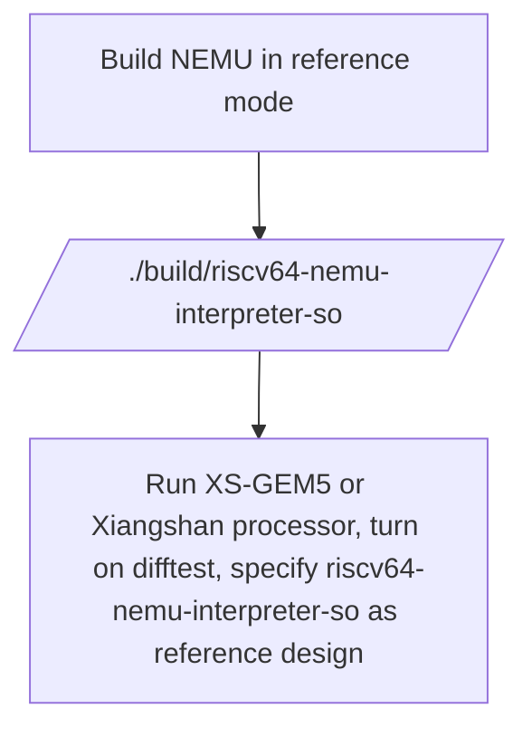
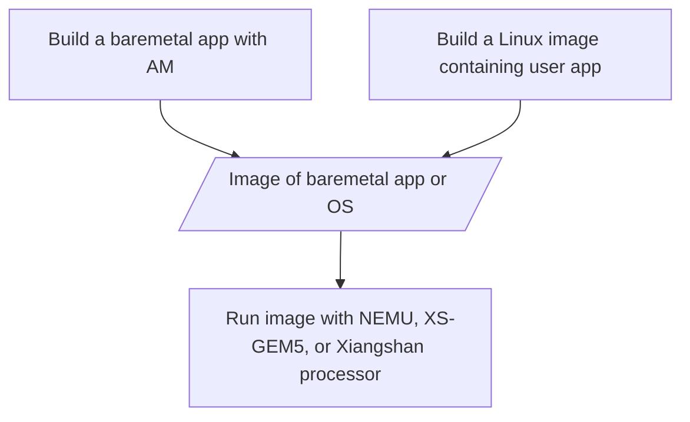
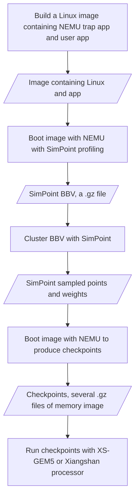

# NEMU

## Abort NEMU

NEMU(NJU Emulator) is a simple but complete full-system emulator designed for teaching purpose.
Originally it supports x86, mips32, riscv64, and riscv32.
**This repo only guarantees the support for riscv64**.

The main features of NEMU include
* a small monitor with a simple debugger
  * single step
  * register/memory examination
  * expression evaluation without the support of symbols
  * watch point
  * differential testing against reference design (e.g. QEMU)
  * snapshot
* CPU core with support of most common ISAs
  * x86
    * real mode is not supported
    * x87 floating point instructions are not supported
  * mips32
    * CP1 floating point instructions are not supported
  * riscv32
    * only RV32IM
  * riscv64
    * rv64gcbh currently
    * rv64gcbhv in the near future
* memory
* paging
  * TLB is optional (but necessary for mips32)
  * protection is not supported for most ISAs, but PMP is supported for riscv64
* interrupt and exception
  * protection is not supported
* 5 devices
  * serial, timer, keyboard, VGA, audio
  * most of them are simplified and unprogrammable
* 2 types of I/O
  * port-mapped I/O and memory-mapped I/O

### What is NOT supported

- Cannot directly run an ELF
  * GEM5's System call emulation is not supported.([What is system call emulation](https://stackoverflow.com/questions/48986597/when-to-use-full-system-fs-vs-syscall-emulation-se-with-userland-programs-in-gem))
  * QEMU's User space emulation is not supported.([What is user space emulation](https://www.qemu.org/docs/master/user/main.html))
- Checkpoint is not compatible with GEM5's SE checkpoints or m5 checkpoints.
  * Cannot produce GEM5's SE checkpoints or m5 checkpoints
  * Cannot run GEM5's SE checkpoints or m5 checkpoints
- Recommend NOT to produce a checkpoint in M-mode

### Please DO NOT

- Please don't running SimPoint bbv.gz with NEMU, XS-GEM5, or Xiangshan processor, because it is not bootable
- Please don't make a new issue without reading the doc
- Please don't make a new issue without searching in issue list
- Please don't make a new issue about building Linux in NEMU's issue list,
plz head to [Xiangshan doc](https://github.com/OpenXiangShan/XiangShan-doc/issues?q=is%3Aissue)


## The role of NEMU in Xiangshan ecosystem

NEMU plays the following roles in Xiangshan ecosystem:
- In reference mode, NEMU is the golden model of Xiangshan processor (paper:
[MINJIE](https://ieeexplore.ieee.org/document/9923860/),
code to adapt NEMU with Xiangshan:[Difftest](https://github.com/OpenXiangShan/difftest))
- In standalone mode, NEMU is able to produce SimPoint BBVs and checkpoints for XS-GEM5 and Xiangshan processor.
- In standalone mode, NEMU can also be used as a profiler for large programs.


## Workflows: How to use NEMU in Xiangshan

### Run in reference mode
NEMU can be used as a reference design
to validate the correctness of Xiangshan processor or XS-GEM5.
Typical workflow is as follows.
Concrete instructions are described in Section [build-NEMU-as-ref](#build-nemu-as-reference-design).



### Run in standalone mode without checkpoint

The typical flow for running workloads is similar for [NEMU](https://github.com/OpenXiangShan/NEMU/),
[XS-GEM5](https://github.com/OpenXiangShan/GEM5),
and [Xiangshan processor](https://github.com/OpenXiangShan/XiangShan).
All of them only support full-system simulation.
To prepare workloads for full-system simulation, users need to either build a [baremetal app](#run-baremetal-app) or
[running user programs in an operating system](#run-opensbi-and-linux).




### Run in standalone to produce checkpoints

Because most of the enterprise users and researchers are more interested in running larger workloads,
like SPECCPU, on XS-GEM5 or Xiangshan processor.
To reduce the simulation time of detailed simulation, NEMU serves as a checkpoint producer.
The flow for producing and running checkpoints is as follows.
The detailed instructions for each step is described in Section [Howto](#howto).



## Howto

### Use NEMU as reference design

#### Build reference.so

To build NEMU as reference design, run
``` bash
make xxx-ref_defconfig
make menuconfig  # save
make -j
```
`./build/riscv64-nemu-interpreter-so` is the reference design.

Specifically, xxx-ref_defconfig varies for different ISA extensions.

| rv64gcb | rv64gcbh | rv64gcbv |
| :-----: | :------: | :-------: |
|  riscv64-xs-ref_defconfig | riscv64-rvh-ref_defconfig | riscv64-rvv-ref_defconfig |


#### Cosimulation

To test XS-GEM5 against NEMU, refer to [the doc of XS-GEM5 Difftest](https://github.com/OpenXiangShan/GEM5?tab=readme-ov-file#difftest-with-nemu).

To test Xiangshan processor against NEMU, run
``` bash
./emu \
  -i test_workload.bin \
  --diff $NEMU_HOME/build/riscv64-nemu-interpreter-so \
  2> perf.out
```
Details can be found in [the tutorial of Xiangshan](https://xiangshan-doc.readthedocs.io/zh-cn/latest/tutorials/rvsc23/).

### Workloads

As described in [the workflow](#run-in-standalone-mode-without-checkpoint), NEMU either takes a baremetal app or
an operating system image as input.

For baremetal app, [Abstract Machine](https://github.com/OpenXiangShan/nexus-am) is a light-weight baremetal library.
Common simple apps like coremark and dhrystone can be built with Abstract Machine.

For build operating system image,
Please read [the doc to build Linux](https://xiangshan-doc.readthedocs.io/zh-cn/latest/tools/linux-kernel-for-xs/).

Then modify `NEMU_HOME` and `BBL_PATH` in `$NEMU_HOME/scripts/checkpoint_example/checkpoint_env.sh` and the workload parameter passed to the function in each example script to get started.


### SimPoint profiling and checkpoint

Please read [the doc to generate checkpoint](https://xiangshan-doc.readthedocs.io/zh-cn/latest/tools/simpoint/)

### Run a checkpoint with XS-GEM5 or Xiangshan processor

Run a checkpoint with Xiangshan processor

```bash
./build/emu -i /path/to/a/checkpoint.gz
```

Run checkpoints with XS-GEM5: [the doc to run XS-GEM5](https://github.com/OpenXiangShan/GEM5?tab=readme-ov-file#run-gem5)

## FAQ

### Why cannot produce a checkpoint in M-mode?

Read the source code of [GCPT restorer](https://github.com/OpenXiangShan/NEMU/blob/master/resource/gcpt_restore/src/restore.S)

Because we restore checkpoint in M mode, and the PC of returning to user mode is stored in EPC register.
This recovery method will break the architecture state (EPC) if the checkpoint is produced in M mode.
In contrast, if the checkpoint is produced in S mode or U mode,
the return process is just like a normal interrupt return, which will not break the architecture state.

<!-- 因为我们在M mode恢复checkpoint，并且最后跳回用户态的 PC用EPC寄存器存储。
这种恢复手段如果在M mode产生checkpoint会破坏体系结构状态（EPC）。
而如果在S mode和 U mode产生checkpoint，返回过程就像一次普通的中断返回一样，不会破坏体系结构状态。 -->

### Cannot build/run NEMU on cpt-bk or tracing branch

Please use master branch. The checkpoint related code is not merged from tracing branch into master

### How to run a checkpoint with Xiangshan processor?

First, make sure you have obtained a checkpoint.gz, not a bbv.gz.
Then, see [the doc to run checkpoints](#run-a-checkpoint-with-xs-gem5-or-xiangshan-processor).

### bbv.gz is empty

First, make sure interval size is smaller than total instruction counter of the application.
Second, it is not necessary to produce checkpoints for small applications with few intervals.

### How to pick an interval size for SimPoint?

Typical sampling interval size used in architecture research is 10M-200M,
while typical warmup interval size is 20M-100M.
It depends on your cache size and use case.
For example, when studying cache's temporal locality, it is better to use a larger interval size (>=50M).

### How long does a 40M simulation take?

The simulation time depends on IPC of the application and the complexity of the CPU model.
For Verilator simulation of Xiangshan processor, the simulation time varies **from hours to days**.
For XS-GEM5, the simulation time varies typically ranges **from 6 minutes to 1 hour**.

### Error when building Linux, riscv-pk, or OpenSBI

First, check [FAQs of building Linux kernel for Xiangshan](https://xiangshan-doc.readthedocs.io/zh-cn/latest/tools/linux-kernel-for-xs/)

Then, try to search solution in [issue list of NEMU](https://github.com/OpenXiangShan/NEMU/issues?q=is%3Aissue) and
[issue list of Xiangshan doc](https://github.com/OpenXiangShan/XiangShan-doc/issues?q=is%3Aissue).

Finally, if you cannot find a solution, please make a new issue in
[Xiangshan doc](https://github.com/OpenXiangShan/XiangShan-doc/issues?q=is%3Aissue).