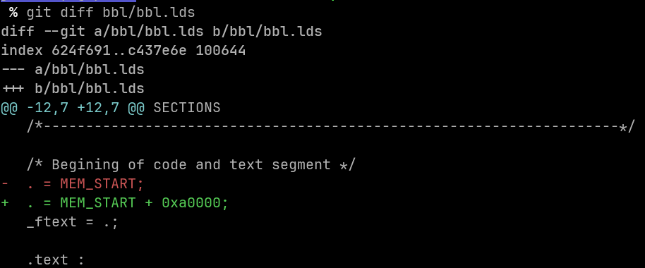
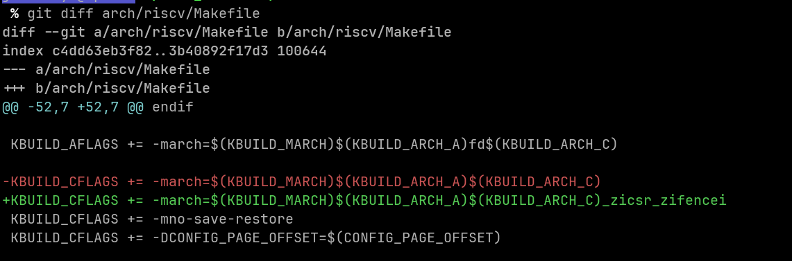
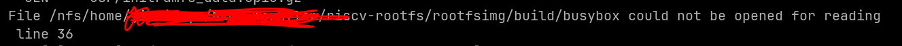
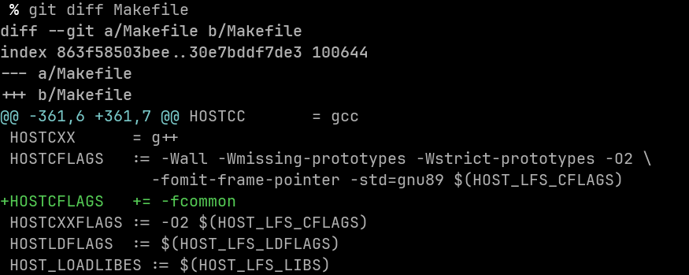

## Prepare image
- Please prepare the riscv64 toolchains in advance, Possible prefix include `riscv64-linux-gnu-` `riscv64-unknown-linux-gnu-` `riscv64-unknown-elf-`
- Clone riscv-pk, riscv-linux, riscv-rootfs from XiangShan project. Please put the three repositories in the same directory.
   - https://github.com/OpenXiangShan/riscv-pk noop branch
   - https://github.com/OpenXiangShan/riscv-linux nanshan branch
   - https://github.com/OpenXiangShan/riscv-rootfs checkpoint branch
- Set environment variables
   - NEMU_HOME: NEMU's path
   - RISCV_ROOTFS_HOME: riscv-rootfs'path
   - RISCV: installation path for riscv-gnu-toolchain(top-level directory path with bin, include, lib, etc.)
- Prepare
   - Config Linux Kernel
      - Go to the riscv-linux directory
      - Configured using fpga_defconfig with the command `make ARCH=riscv CROSS_COMPILE=riscv64-linux-gnu- fpga_defconfig`
      - The command to make ARCH=riscv CROSS_COMPILE=riscv64-linux-gnu- menuconfig is to make changes to menuconfig according to your needs. One of the **more necessary changes** is to change the source of initramfs from `$(RISCV_ROOTFS_HOME)/rootfsimg/initramfs.txt` to `${RISCV_ROOTFS_HOME}/rootfsimg/initramfs-spec.txt`
   - Configuring BBL
      - Go to the riscv-pk directory
      - Modify the size of the address space in dts to support running programs with larger memory.
      ```

      L11: memory@100000000 {
          device_type = "memory";
          --- reg = <0x0 0x80000000 0x0 0x2000000>;
          +++ reg = <0x0 0x80000000 0x0 0x80000000>;
      };
      ```

      - Apply this [commit](https://github.com/riscv-software-src/riscv-pk/commit/4ae5a8876fc2c31776b1777405ab14f764cc0f36)
      - NEMU needs to add a section of recovery program when generating checkpoint. So you need to avoid this space when generating checkpoint. So you need to avoid this space when generating the workload In `riscv-pk/bbl/bbl.lds`, change `.` address to `MEM_START + 0xa0000` i.e. `. = MEM_START + 0xa0000` 
   - Build NEMU
      - Using command `git submodule update --init` sync sub modules
      - Execute make in the `NEMU/resource/simpoint/simpoint_repo` directory to get the executable file `NEMU/resource/simpoint/simpoint_repo/bin/simpoint`
      - Execute `make riscv64-xs_defconfig` in the `$(NEMU_HOME)` directory, then execute `make menuconfig` to tweak the desired options on your own, then execute make.
      - Execute the make command in `NEMU/resource/gcpt_restore` directory to compile gcpt.bin

## Build

- Modify initramfs-spec.txt and run.sh in $(RISCV_ROOTFS_HOME)/rootfsimg, write the files you want to put into rootfs into initramfs-spec.txt, and write the ready-to-run command in run.sh. By default, hello will be used as the workload, if you want to use simpoint profiling and checkpoint, you need to prepare your own workload.
- Go to the riscv-pk directory, exec `make clean` first, then exec `make -j`, the binart file bbl.bin is generated in the build directory.
- See the FAQ section if you have any questions.

## FAQ

- Compile prompt: "Error: unrecognized opcode csr*, extension 'zicsr' required"
   - cause: Wrong version of GCC
   - solution: Add `_zicsr_zifencei` in `arch/riscv/Makefile`
   - screenshot: 

- Compile prompt: "busybox not found"
   - cause: Error while pulling busybox
   - solution: Go to the `$(RISCV_ROOTFS_HOME)/apps/busybox` directory and delete `repo` directory in it, then manually execute make in `$(RISCV_ROOTFS_HOME)/apps/busybox`, and if everything works, you will see busybox start to compile and eventually generate a soft link to `repo/busybox` in the build directory.
   - screenshot: 

- Compile prompt: 'multiple definition of yylloc'
   - cause: Wrong version of GCC
   - solution: Add `HOSTCFLAGS += -fcommon` to the `Makefile` in the top-level directory of `riscv-linux`
   - screenshot: 
   - screenshot: 
